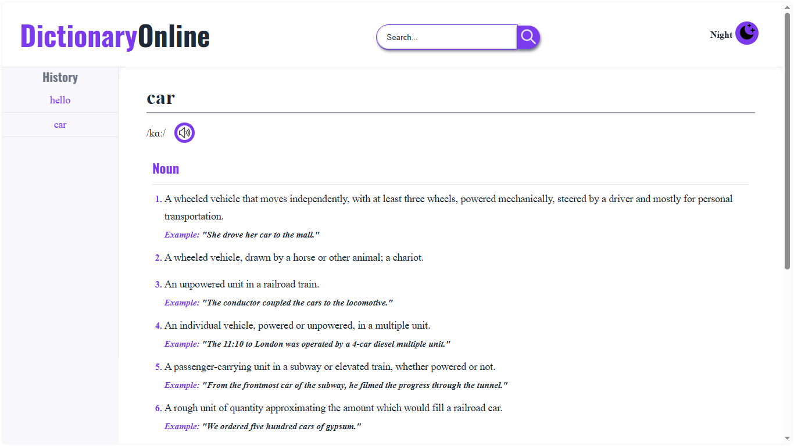
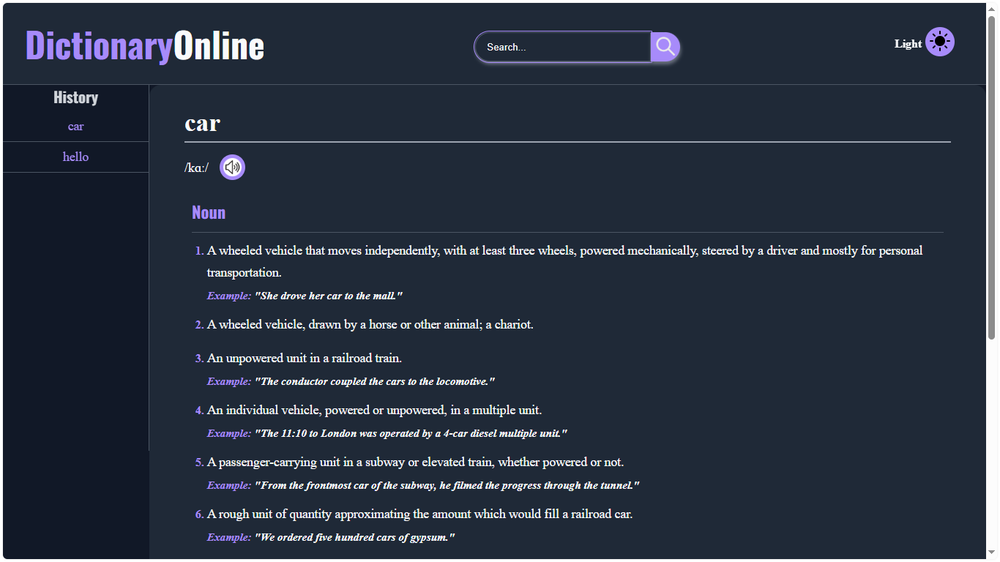

# 📖 Dictionary Online SPA

A modern **Single Page Application (SPA)** that allows users to search for English words and obtain their definitions, phonetics, pronunciations, synonyms, and antonyms through a clean and responsive interface.

The project follows a **Frontend + Backend architecture**, where the frontend is built with vanilla JavaScript and the backend is developed using FastAPI.

---

## 📸 Preview

> **Landing Page**


> **Search Result**



> **Dark Mode**



---

# ✨ Features

- 🔍 Search English words instantly.
- 🔊 Listen to word pronunciation.
- 📚 Display multiple meanings grouped by part of speech.
- 📝 Show synonyms and antonyms.
- 🕒 Search history panel.
- 🌙 Light / Dark mode.
- 📱 Responsive interface.
- ⚠️ Friendly error handling.
- 🧩 Modular JavaScript architecture.
- 🚀 FastAPI REST API.

---

# 🛠️ Technologies

## Frontend

- HTML5
- CSS3
- JavaScript (ES6 Modules)

## Backend

- Python 3
- FastAPI
- Pydantic
- Uvicorn

## External API

- DictionaryAPI

---

# 📂 Project Structure

```text
Dictionary-spa
│
├── backend
│   ├── models
│   ├── services
│   ├── .env
│   ├── main.py
│   └── requirements.txt
│
├── frontend
│   ├── assets
│   ├── css
│   ├── js
│   │   ├── api
│   │   ├── components
│   │   ├── services
│   │   └── utils
│   ├── app.js
│   └── index.html
│
├── .gitignore
└── README.md
```

---

# 🏗️ Architecture

```text
                User
                  │
                  ▼
         HTML / CSS / JavaScript
                  │
              Fetch API
                  │
                  ▼
             FastAPI Backend
                  │
                  ▼
          DictionaryAPI Service
                  │
                  ▼
             JSON Response
                  │
                  ▼
             Rendered Result
```

---

# 🚀 Installation

## 1. Clone the repository

```bash
git clone [https://github.com/gpinedaovido/dictionary-spa.git](https://github.com/gpinedaoviedo/dictionary-spa.git)
```

---

## 2. Navigate to the backend

```bash
cd backend
```

---

## 3. Create a virtual environment

Windows

```bash
python -m venv .venv
```

Activate

```bash
.venv\Scripts\activate
```

Linux / macOS

```bash
python3 -m venv .venv
source .venv/bin/activate
```

---

## 4. Install dependencies

```bash
pip install -r requirements.txt
```

---

## 5. Run the API

```bash
uvicorn main:app --reload
```

The backend will be available at:

```
localhost: http://127.0.0.1:8000
Render: https://dictionary-online.onrender.com/
```

---

## 6. Open the frontend

Open

```
https://dictionary-spa-gapo.vercel.app/
```
```
https://english-dictionary-online.vercel.app/
```
```
frontend/index.html
```

or use **Live Server** in Visual Studio Code.

---

# 🌐 API Endpoint

## Search Word

```
GET /api/search/en/definition?word=${data}
```

Example

```
GET /api/search/en/definition?word=car
```

Example Response

```json
{
  "word": "car",
  "phonetics": [],
  "meanings": []
}
```

---

# 📁 Frontend Modules

```
api/
```

Handles communication with the FastAPI backend.

```
components/
```

Responsible for rendering UI elements.

- Meaning
- Phonetic
- Error
- History Panel

```
services/
```

Application business logic.

```
utils/
```

Reusable helper functions.

---

# 📱 Responsive Design

The application is optimized for:

- Desktop
- Tablet
- Mobile Devices

---

# 🌙 Dark Mode

The interface includes a complete Light / Dark theme based on CSS Variables.

Themes change:

- Background
- Surface colors
- Typography
- Buttons
- Borders
- Cards

---

# ⚙️ Accessibility

The project includes accessibility improvements such as:

- Semantic HTML
- Accessible buttons
- Keyboard navigation
- Focus states
- ARIA labels
- Responsive layout

---

# 📈 Future Improvements

- ⭐ Favorite words
- 🌎 Multiple languages
- 🔎 Search suggestions
- 💾 Offline cache
- 📚 Word of the Day
- 📖 Recently viewed words

---

# 📄 License

This project is licensed under the MIT License.

---

# 👨‍💻 Author

**Oviedo 01**

Systems Engineering Student

GitHub:
https://github.com/gpinedaoviedo

LinkedIn:
https://www.linkedin.com/in/gery-a-pineda-oviedo-76300522a/
---

⭐ If you found this project useful, consider giving it a star on GitHub.
